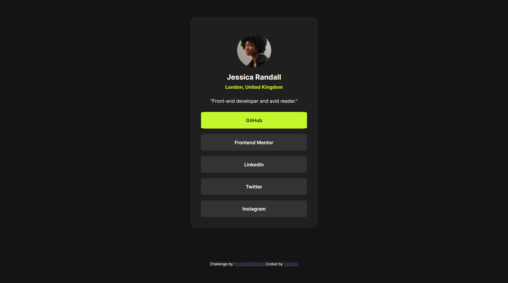

# Frontend Mentor - Social links profile solution

This is a solution to the [Social links profile challenge on Frontend Mentor](https://www.frontendmentor.io/challenges/social-links-profile-UG32l9m6dQ). Frontend Mentor challenges help me improve my coding skills by building realistic projects. 

## Table of contents

- [Overview](#overview)
  - [The challenge](#the-challenge)
  - [Screenshot](#screenshot)
  - [Links](#links)
- [My process](#my-process)
  - [Built with](#built-with)
  - [What I learned](#what-i-learned)
  - [Continued development](#continued-development)
  - [Useful resources](#useful-resources)
- [Author](#author)
- [Acknowledgments](#acknowledgments)

## Overview

### The challenge

Users should be able to:

- See hover and focus states for all interactive elements on the page

### Screenshot

### Links

- Solution URL: [Github repo](https://github.com/yvonne0711/social-links-profile)
- Live Site URL: [Live site](https://yvonne0711.github.io/social-links-profile/)

## My process

### Built with

- Semantic HTML5 markup
- CSS custom properties
- Flexbox

### What I learned

Worked on CSS properties and flexbox, focusing on width in CSS.

### Continued development

I want to develop my knowledge on width and CSS Flexbox.

## Author

- Website - [Yvonne Wong](https://yvonnes-portfolio.netlify.app/)
- Frontend Mentor - [@yvonne0711](https://www.frontendmentor.io/profile/yvonne0711)
